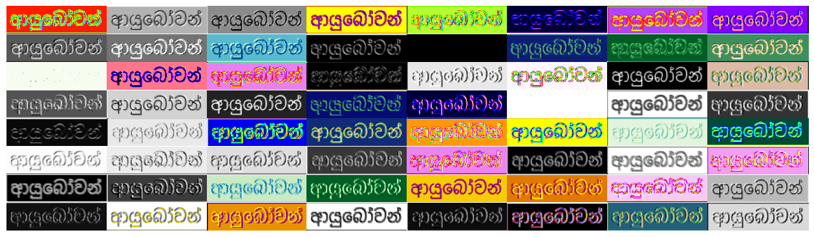
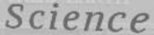
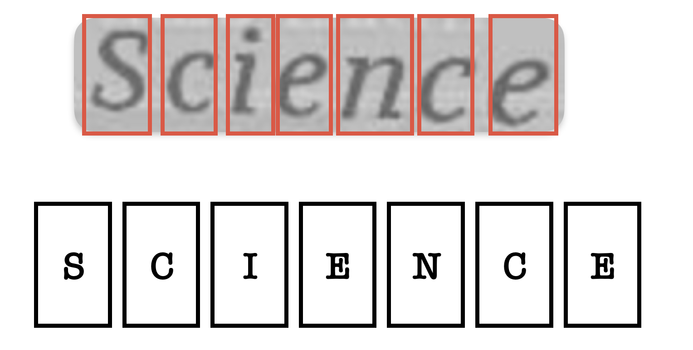
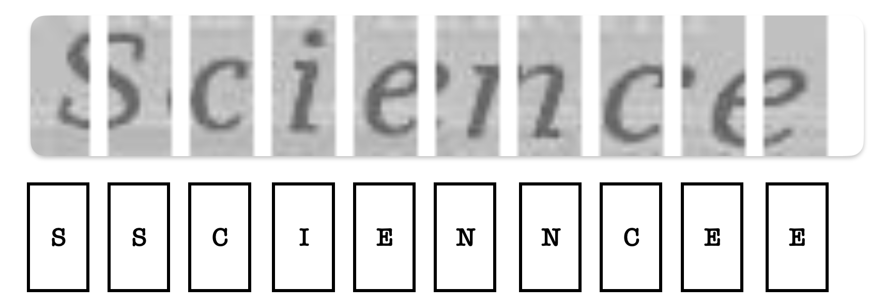
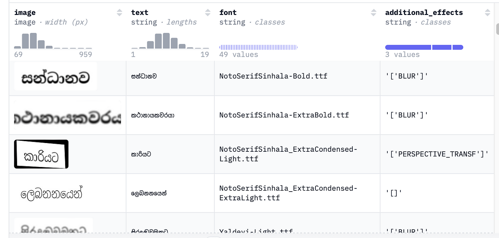
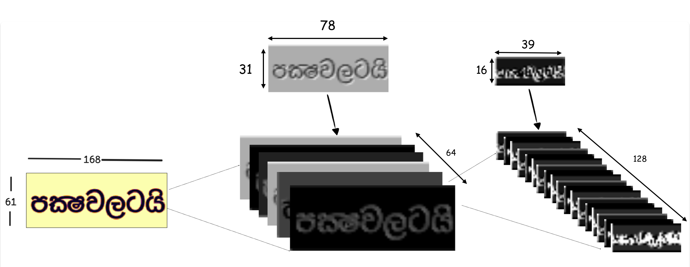
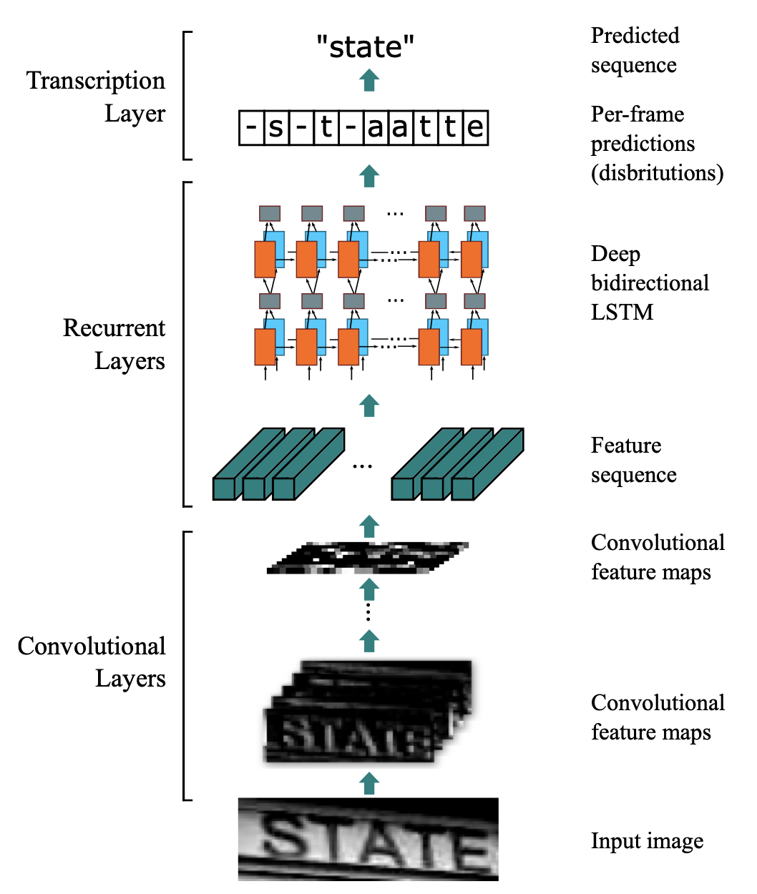
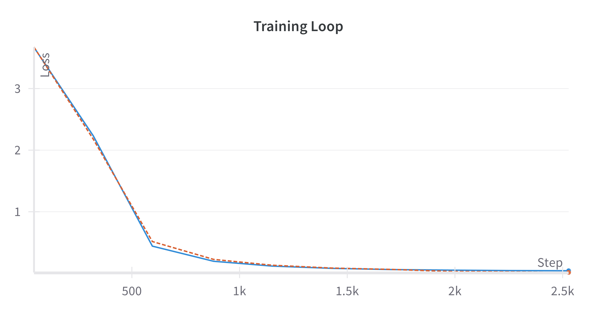

# Building CRNN model for Sinhala OCR Tasks
### _Step-by-step guide to training own OCR model_


## Opening thoughts

If you're reading this article, you likely have different interests than the majority. It's rare to find someone wanting to build a CRNN model in this era of LLM hype, which makes this quite refreshing. Next, I want to share my motivation behind this article. However, if you feel that's unnecessary, you can directly jump into [this section](#understanding-crnn). So, my motivation behind this article(possibly an article series) is making people want to play around with RNNs. RNNs are the pioneers in this sequence modelling before transformers come into play. Most concepts we are now trying out with transformers have [evolved from RNNs](https://arxiv.org/pdf/1409.0473). Therefore, I believe these concepts with RNNs make much more sense than those with more complex and heavy-weight transformer architecture. As per this thought process, I decided to go ahead with it. While I learn these, I am using these articles to digest these concepts better. Alright, enough talking. Let's jump into the actual article.

## Understanding CRNN
CRNN (Convolutional Recurrent Neural Network) was first proposed in the paper _An End-to-End Trainable Neural Network for Image-based Sequence Recognition and Its Application to Scene Text Recognition_. As the name implies, the architecture comprises a convolutional neural network with an RNN model. But how? Let me explain. First, forget about these terms: RNNs, CNNs, etc. How would you do that if you were supposed to read the text in the image below?



It's pretty simple, right? All you need to know is to scan the image with your eyes. Once you understand the first character, you shift right (or left, depending on the language). You continue this process until you reach the end of the image. This is exactly what CRNNs do under the hood. The only difference is that you've trained to do this throughout your life, unlike these models, which only have a few days to achieve the same results. ¯\/_(ツ)_/¯

But there is a tiny difference. We humans can understand a character at first glance.



On the other hand, machines are quite incapable of this as they are limited by capturing only spatial representation, the amount of data they can access at certain points and, more importantly, the nature of data we put in. Intuitively, if we need to build a system capable of predicting corresponding text in certain regions, we should have a properly annotated dataset. One possibility would be to create patches of images and assign characters to each, like this.



In practice, creating this kind of dataset requires some serious manpower and careful annotations. But we can do the trick; what if we allow a CNN model to self-create these patches and then label each patch based on its spatial representation? That might work, isn't it? But again, an obstacle: If you check the above image, you will notice that you need both the first and second patches to predict _S_. The same goes with E and C above. Therefore, we will predict the current label based on information from previous patches and the current patch itself. In other words, it's sequence modelling. And that's where RNN comes in here. 
So far in the explanation, you have probably noted how we transitioned this OCR task into CNN and RNN. More intuitively, that is why they called this CRNN. It has tackled the OCR problem using a combination of CNN and RNN. CNN to learn spatial features in the image, then pass into RNN to detect the relationship between patches(feature maps) and produce the final output. 
I'm using [this](https://huggingface.co/datasets/Ransaka/SSOCR-V.1) dataset in the later part of this article. It contains synthetic images suitable for OCR tasks. You can access the generation script in [this code repository](https://github.com/Ransaka/rnn-playground/tree/main/rnn-for-sinhala-ocr). Furthermore, all codes related to this article can be accessed from the same GitHub repository.



## More detailed explanation about the model architecture.

As initially discussed, it has two components: CNN and RNN. However, the original paper stated a third component, the transcription layer. That's where we post-process predicted output and generate final predictions. Furthermore, unlike traditional CNN, we don't need to use a fully connected layer as the final layer, as final feature maps are transformed into feature vectors and then passed to RNN. This results in many-to-one mapping between feature vectors and corresponding labels. In the dataset, it's just an image, and text appears (See Fig 2). Hence, the model is supposed to align the text with a sequence of feature vectors by itself.

## Feature vectors, feature maps and image patches

Perhaps you needed clarification on these three, as I often used them in the explanation. Here's the explanation. Image patches are horizontal or vertical (or a combination of both) image segments, as shown in Fig. That has nothing to do with this CRNN model. I only used it in the article to get the reader used to the concept of CRNN. However, feature maps and feature vectors deserve more explanation because they are major components of CRNN architecture.

## Feature maps

[Feature maps](https://stats.stackexchange.com/questions/291820/what-is-the-definition-of-a-feature-map-aka-activation-map-in-a-convolutio) are the product of CNN. When the image passes through convolution and pooling layers, it transforms into several feature maps. Each convolution layer applies a different filter, and when we perform this for multiple layers, we have a very abstract view of the input image. A pooling layer is also applied between convolution layers to retain the most usable feature. This will reduce the resulting feature map dimension. Ultimately, the resulting feature maps can be considered feature-rich and efficient  representations of the input image. Due to dimensionality reduction, a small area in a resulting feature map corresponds to a larger area in the input image. We call that receptive field. Nevertheless, to understand feature maps in the context of CRNN, all you need to know is that feature maps have very specialized representations of input features, which we transform as feature vectors.

Let's assume we have a 61 x 157 image. Our model comprises two convolution and max pooling layers with a kernel size of 2 x 2 and stride as 1. If we do [the math](https://stackoverflow.com/questions/34739151/calculate-dimension-of-feature-maps-in-convolutional-neural-network), the resulting feature maps will take the below shapes.



## Feature vectors

According to a research paper, this is the definition of the feature vector.
>Each feature vector of a feature sequence is generated from left to right on the feature maps by column. This means the i-th feature vector is the concatenation of the i-th columns of all the maps. The width of each column in our settings is fixed to single pixel.

This means that for each feature map, pick a one-pixel-wide column. The resulting vector is 16 x 1 for a single feature map. Since we have 128 feature maps, the final feature vector corresponding to the first image patch will be 128 x 16. This vector will then be fed into RNN at time step t. Likewise, we can perform this until the end of our sequence. One advantage here is that RNNs can unroll into any required sequence length. Therefore, we are not limited by image width but by image height. One more advancement researchers made in the original paper was using bi-directional LSTM instead of vanilla LSTM. This allows the feature vector at the t step to communicate with the feature vector at the _t-k_ and _t+k_ time steps, where _k>0_. Generally, this works well as it's obvious to make predictions based on important feature vectors in both directions.



## Coding CRNN architecture

> [!WARNING]  
> Since we are working on a relatively simple dataset, I am doing a few simplifications on top of the original model.

To make the architecture simple and intuitive, I only added two convolutions with max pooling for the CNN feature extractor, a bidirectional LSTM layer for sequence modelling and a fully connected layer. For each timestamp, the RNN + Fully connected layer will generate a probability distribution for all characters in the vocabulary. Once we have the probability distribution, we can pick a character with maximum probability. However, we must use the loss function during model training to update the parameters. Unfortunately, like language modelling, we cannot calculate negative log-likelihood (or similar) loss for this type of work, as we don't have the desired characters for each feature vector (or timestamp). Therefore, our best bet would be to use some loss function which supports unaligned input and outputs, such as CTC loss.

## Model using PyTorch

```Python
import torch.nn as nn

class CRNN(nn.Module):
    def __init__(self, num_channels, hidden_size, num_classes):
        super(CRNN, self).__init__()

        self.conv1 = nn.Sequential(
            nn.Conv2d(1, num_channels, kernel_size=(2,3), padding=1),
            nn.ReLU(),
            nn.MaxPool2d(2, 2)
        )
        
        self.conv2 = nn.Sequential(
            nn.Conv2d(num_channels, num_channels * 2, kernel_size=(2,3), padding=1),
            nn.ReLU(),
            nn.MaxPool2d(2, 2)
        )

        self.rnn = nn.LSTM(num_channels * 2 * 16, hidden_size, bidirectional=True, batch_first=True)

        self.fc = nn.Linear(hidden_size * 2, num_classes)

    def forward(self, x):
        # x shape: [batch_size, channels, height, width]

        # CNN feature extraction
        conv = self.conv1(x)
        conv = self.conv2(conv)
        batch, channels, height, width = conv.size()

        conv = conv.permute(0, 3, 1, 2)  # [batch, width, channels, height]
        conv = conv.contiguous().view(batch, width, channels * height)

        rnn, _ = self.rnn(conv)

        output = self.fc(rnn)

        return output
```

## Preprocessing data

```python
import torchvision 
import torch
from torch.utils.data import Dataset
from torch.nn.utils.rnn import pad_sequence

class AddGaussianNoise(object):
    def __init__(self, mean=0., std=1., thresh=0.2):
        self.mean = mean
        self.std = std
        self.thresh = thresh
        
    def __call__(self, tensor):
        noise = torch.zeros_like(tensor)
        noise[tensor>self.thresh] = 1
        noise *= torch.randn(tensor.size()) * self.std + self.mean
        return tensor + noise
    
    def __repr__(self):
        return self.__class__.__name__ + f'(mean={self.mean}, std={self.std})'


class TextProcessor:
    def __init__(self, alphabet):
        self.alphabet = alphabet
        self.pad_token = "[PAD]"
        self.stoi = {s: i for i, s in enumerate(self.alphabet,1)}
        self.stoi[self.pad_token] = 0
        self.itos = {i: s for s, i in self.stoi.items()}
        
    def encode(self, label):
        return [self.stoi[s] for s in label]
    
    def decode(self, ids):
        return ''.join([self.itos[i] for i in ids])
    
    def __len__(self):
        return len(self.alphabet) + 1

transform_train = torchvision.transforms.Compose(
    [   
        torchvision.transforms.Grayscale(),
        torchvision.transforms.ToTensor(),
        torchvision.transforms.RandomApply([
            torchvision.transforms.RandomAdjustSharpness(sharpness_factor=80),
            AddGaussianNoise(mean=0, std=1),
            ])
    ]
)

transform_eval = torchvision.transforms.Compose(
    [   
        torchvision.transforms.Grayscale(),
        torchvision.transforms.ToTensor()
    ]
)

class CRNNDataset(Dataset):
    def __init__(
            self, 
            height, 
            text_processor:TextProcessor, 
            transforms:torchvision.transforms,
            dataset=None
            ) -> None:
        super().__init__()

        self.height = height
        self.transform = transforms
        self.dataset = dataset
        
        self.text_processor = text_processor

    def __len__(self):
        return len(self.dataset)

    def __getitem__(self, idx):
        dset = self.dataset[idx]
        image, text = dset['image'], dset['text']
        label = torch.tensor(self.text_processor.encode(text), dtype=torch.long)
        original_width, original_height = image.size
        new_width = int(self.height * original_width / original_height)  # Calculate width to preserve aspect ratio
        image = image.resize((new_width, self.height))
        image = self.transform(image)
        return image, label
    

def collate_fn(batch):
    images, labels = zip(*batch)
    
    max_h = max(img.size(1) for img in images)
    max_w = max(img.size(2) for img in images)
    
    padded_images = []

    for img in images:
        h, w = img.size(1), img.size(2)
        padding = (0, max_w - w, 0, max_h - h)  # left, right, top, bottom
        padded_img = torch.nn.functional.pad(img, padding, mode='constant', value=0)
        padded_images.append(padded_img)
    
    images = torch.stack(padded_images, 0)
    
    target_lengths = torch.tensor([len(label) for label in labels]).long()

    labels = pad_sequence(labels, batch_first=True, padding_value=0)
    
    return images, labels, target_lengths
```

For example, I have added some random transformations for training data.


## Model training

```python
from torch.utils.data import DataLoader
from datasets import load_dataset
import pickle
from data_processing import TextProcessor, CRNNDataset, collate_fn, transform_eval, transform_train
from utils import post_process, upload_to_hub
from multiprocessing import cpu_count
from model import CRNN
import torch.nn as nn
import torch
import wandb
import random 
from datetime import datetime
import torchvision

hf_token = 'token'
wandb_token = "token"

random.seed(43)
torch.manual_seed(34)


def load_data(batch_size, dataset_name):
    num_workers = cpu_count()
    dataset = load_dataset(dataset_name, num_proc=num_workers, token=hf_token)
    splits = dataset.keys()
    all_text_splits = [dataset[split]['text'] for split in splits]
    all_text = sum(all_text_splits,[])
    chars = [list(ch) for ch in all_text]
    chars_all = [c for char in chars for c in char]
    alphabet = set(chars_all)
    text_processor = TextProcessor(alphabet)
    
    if len(splits)==1:
        train_splits = test_split = 'train'
    else:
        train_splits, test_split = 'train','test'

    #pickle text processor for future use
    with open("text_process.cls","wb") as f:
        pickle.dump(text_processor, f)
    
    #upload to hfhub
    upload_to_hub(file_name='text_process.cls', token=hf_token, commit_message='Uploading text processor')
    

    dset_train = CRNNDataset(height=61, text_processor=text_processor, dataset=dataset[train_splits], transforms=transform_train)
    dset_val = CRNNDataset(height=61, text_processor=text_processor, dataset=dataset[test_split], transforms=transform_eval)

    train_dataloader = DataLoader(
        dset_train, 
        batch_size=batch_size, 
        shuffle=True, 
        collate_fn=collate_fn,
        num_workers=num_workers
        )
    val_dataloader = DataLoader(
        dset_val, 
        batch_size=batch_size, 
        shuffle=False, 
        collate_fn=collate_fn,
        num_workers=num_workers
        )
    
    return train_dataloader, val_dataloader, len(text_processor)


def train_crnn(model, train_loader, criterion, optimizer, device):
    model.train()
    for batch_idx, (data, labels, target_lengths) in enumerate(train_loader):
        data = data.to(device)
        labels = labels.to(device)
        target_lengths = target_lengths.to(device)

        optimizer.zero_grad()
        outputs = model(data)
        log_probs = outputs.log_softmax(dim=2)
        log_probs = log_probs.permute(1, 0, 2)
        input_lengths = torch.full((outputs.size(0),), outputs.size(1), dtype=torch.long, device=device)

        loss = criterion(log_probs, labels, input_lengths, target_lengths)
        
        loss.backward()
        optimizer.step()
    return loss.item()


def eval_crnn(model, val_loader, criterion, device):
    model.eval()
    total_loss = 0
    with torch.no_grad():
        for data, labels, target_lengths in val_loader:
            data = data.to(device)
            labels = labels.to(device)
            target_lengths = target_lengths.to(device)

            outputs = model(data)
            log_probs = outputs.log_softmax(dim=2)
            log_probs = log_probs.permute(1, 0, 2)
            input_lengths = torch.full((outputs.size(0),), outputs.size(1), dtype=torch.long, device=device)

            loss = criterion(log_probs, labels, input_lengths, target_lengths)
            total_loss += loss.item()
    model.train()
    return total_loss / len(val_loader)


def predict_on_sample(model, eval_dataset:CRNNDataset, device):
    decode = eval_dataset.text_processor.decode
    idx = random.randint(0, len(eval_dataset.dataset))
    inputs = eval_dataset[idx][0]
    to_pil = torchvision.transforms.ToPILImage()
    pil_image = to_pil(inputs)
    inputs = inputs.unsqueeze(0)
    model.eval()
    
    with torch.no_grad():
        predictions = model(inputs.to(device))
    predictions = predictions.detach().cpu()
    pred_ids = torch.argmax(predictions, dim=-1).flatten().tolist()
    text = post_process(decode,pred_ids)
    return pil_image, text


def train(epochs, hidden_size, batch_size, eval_interval, device, dataset_name, lr=1e-3):
    train_dataloader, val_dataloader, num_classes = load_data(dataset_name=dataset_name, batch_size=batch_size)
    model = CRNN(num_channels=1, hidden_size=hidden_size, num_classes=num_classes)
    criterion = nn.CTCLoss()
    optimizer = torch.optim.Adam(model.parameters(), lr=lr)

    model.to(device)
    train_loss = {}
    val_loss = {}
    best_eval_loss = float('inf')

    print("starting model training...")
    for epoch in range(epochs):
        loss = train_crnn(model, train_dataloader, criterion, optimizer, device)
        train_loss[epoch] = loss
        if epoch % eval_interval == 0:
            eval_loss = eval_crnn(model, val_dataloader, criterion, device)
            print(f"Epoch {epoch} | Train Loss: {loss:.3f} | Val Loss: {eval_loss:.3f}")
            infer_image, predicted_text = predict_on_sample(model, eval_dataset=val_dataloader.dataset, device=device)
            log_data = {
                "step": epoch,
                "eval_loss": eval_loss,
                "train_loss": loss,
                "predictions": wandb.Image(
                    infer_image,
                    caption=f"Prediction: {predicted_text}"
                )
            }
            val_loss[epoch] = eval_loss
            wandb.log(log_data)

            if eval_loss < best_eval_loss:
                print("Saveing best model")
                torch.save(model.state_dict(), "crnn.pt")
                upload_to_hub("crnn.pt", token=hf_token, commit_message=f'Upload best model at {str(epoch)}')
                best_eval_loss = eval_loss
            


if __name__ == "__main__":
    #logging related data
    wandb.login(key=wandb_token)
    today = datetime.now().strftime("%d/%m/%Y, %H:%M:%S")
    wandb_project = "crnn-sinhala"
    wandb_run_name = f"crnn-run-{today}"
    
    dataset_name = "Ransaka/SSOCR-1K"
    device = "cuda" if torch.cuda.is_available() else "cpu"
    epochs = 100
    batch_size = 1024
    eval_interval = int(epochs/10)
    hidden_size = 256

    #init logger
    config = dict(epochs=epochs, batch_size=batch_size,eval_intervale=eval_interval, hidden_size=hidden_size)
    wandb.init(project=wandb_project, name=wandb_run_name, config=config)
    
    #start training
    train(
        epochs,
        hidden_size,
        batch_size,
        eval_interval,
        device,
        dataset_name
    )
```

## Training performance and testing the model

Due to the dataset's simplicity, the model converges without any struggle.



## Closing thoughts

Even though the above model performed well on training data, its real-world performance is awful. This is due to several reasons: a less sophisticated dataset and a more basic model architecture (skipped batch and dropout layers). I purposely removed the in-depth explanation of CTC loss and its usefulness to make the reader more focused on the CRNN model, especially the RNN part. If you want to read more about it, I recommend this article.

You can access the model via [this hf space](https://huggingface.co/spaces/Ransaka/OCR-CRNN).

Some references I found useful,

1. https://colah.github.io/posts/2015-08-Understanding-LSTMs/
2. https://stats.stackexchange.com/questions/291820/what-is-the-definition-of-a-feature-map-aka-activation-map-in-a-convolutio
3. https://ujjwalkarn.me/2016/08/11/intuitive-explanation-convnets/
4. https://stackoverflow.com/questions/34739151/calculate-dimension-of-feature-maps-in-convolutional-neural-network

### _Thank you!!_