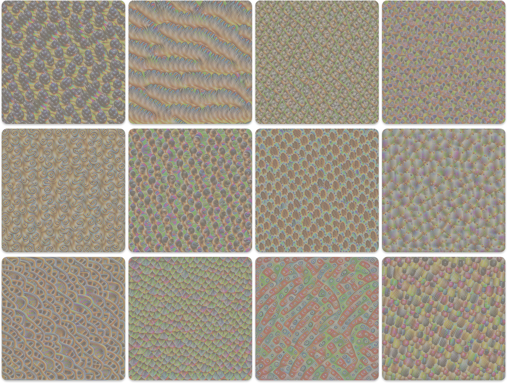
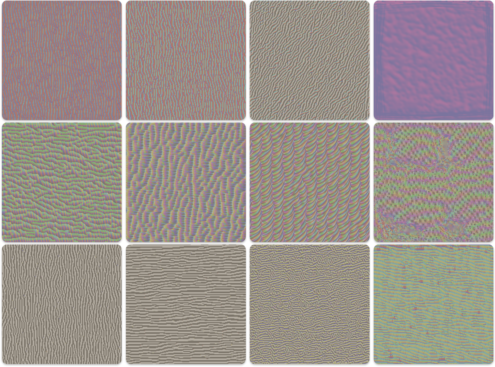
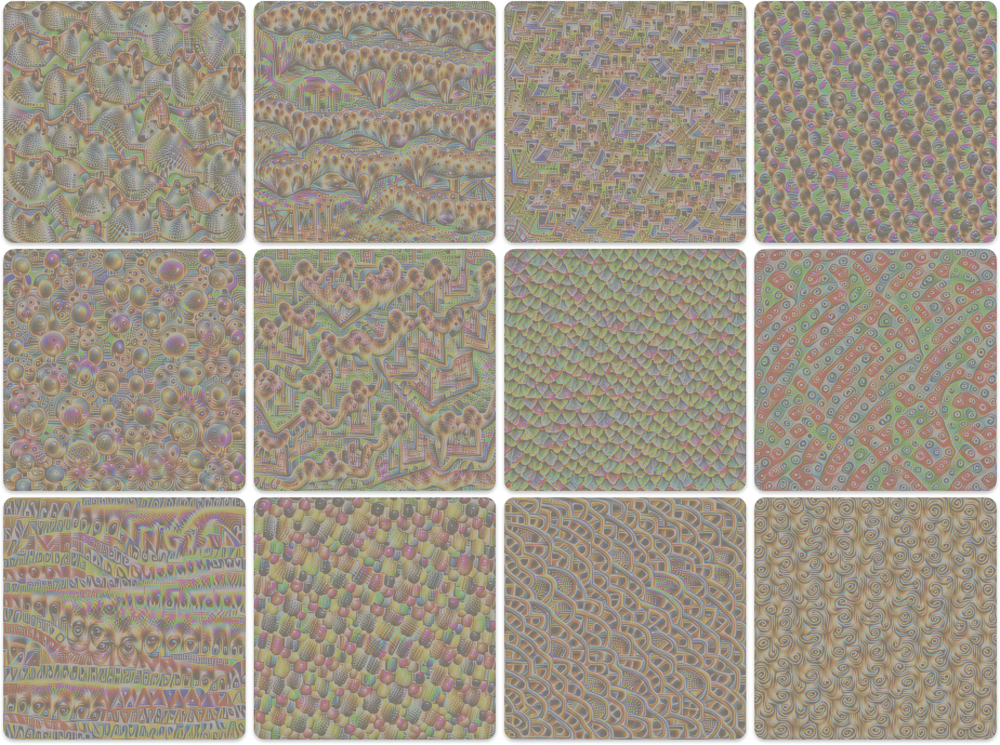

# Visualizing CNN Features with Activation Maximization



Convolutional Neural Networks (CNNs) have achieved remarkable success in computer vision tasks. However, they are often treated as "black boxes." We know they learn hierarchical features – simple edges and textures in early layers, more complex object parts in deeper layers – but what exactly does a specific neuron "look for"? Feature Visualization, specifically through **Activation Maximization**, provides a powerful technique to answer this question.

The core idea is fascinatingly simple: **To understand what excites a specific neuron, let's generate an input image that makes that neuron fire as strongly as possible.**

This post explains the process, based on optimizing an input image for a VGG16 model, including the underlying math.

## The Goal: Maximizing Neuron Activation

Imagine we have a pre-trained CNN (like VGG16). We select:

1.  A specific **layer** within the network (e.g., a convolutional layer).
2.  A specific **channel** (or filter/neuron) within that layer's output activation map.

Our goal is to create an image, starting from noise or a gray canvas, that produces the highest possible average activation value for that chosen channel when fed through the network.

## The Method: Optimization via Gradient Ascent

We don't train the network; its weights remain fixed. Instead, we optimize the *input image* itself. How? Using gradients!

1.  **Start:** Initialize a random or gray input image, `I`.
2.  **Forward Pass:** Feed the image `I` through the frozen network.
3.  **Measure Activation:** Record the activation value(s) of our target neuron/channel in the target layer. Let's denote the mean activation of channel `c` in layer `l` as `a_{l,c}(I)`.
4.  **Calculate Gradient:** Compute the gradient of this activation with respect to the *pixels of the input image* `I`. This gradient, `∇_I a_{l,c}(I)`, tells us how to change each pixel in `I` to *increase* the activation `a_{l,c}` the most.
5.  **Update Image:** Adjust the image pixels slightly in the direction of the gradient (this is gradient *ascent*).
    `I ← I + η * ∇_I a_{l,c}(I)`
    where `η` is the learning rate.
6.  **Repeat:** Go back to step 2 with the updated image and repeat for many iterations.

Since most optimization libraries are built for gradient *descent* (minimization), we typically frame this as minimizing the *negative* activation:

**Objective Function (Basic):**
Minimize `L_objective = - mean(a_{l,c}(I))`

## The Problem: Unconstrained Optimization Creates Noise

If we only optimize the objective above, the resulting images often look like high-frequency noise or abstract patterns specifically tailored to exploit the network, rather than resembling natural images. The optimizer finds "shortcuts" to maximize activation that don't correspond to meaningful features. This term is nicely discussed in [this](https://distill.pub/2017/feature-visualization/#preconditioning) amazing blogpost

## The Solution: Regularization

To encourage more "natural" or interpretable images, we add penalty terms to our loss function. These regularizers discourage undesirable image properties.

### 1. Total Variation (TV) Regularization

*   **Purpose:** Encourages spatial smoothness by penalizing large differences between adjacent pixel values. This reduces noise and checkerboard artifacts.
*   **Math:** The Total Variation loss (`L_TV`) sums the squared differences between neighboring pixels horizontally and vertically.

    
    $L_{TV}(I) = \sum_{i, j} \left( (I_{i+1, j} - I_{i, j})^2 + (I_{i, j+1} - I_{i, j})^2 \right)$

    *(Where `I_{i,j}` is the pixel value at row `i`, column `j`. Often normalized by image size)*

### 2. L2 Regularization

*   **Purpose:** Penalizes large pixel values (very bright or very dark pixels). It helps keep pixel values within a reasonable range and reduces the overall "energy" of the image.
*   **Math:** The L2 loss (`L_L2`) is simply the sum of the squared values of all pixels in the image.

    $L_{L2}(I) = \sum_{i, j} I_{i, j}^2 = ||I||_2^2$

## The Combined Loss Function

We combine the negative activation objective with the regularization terms, using weights (`λ_TV`, `λ_L2`) to control the influence of each regularizer:

$L_{total}(I) = L_{objective} + \lambda_{TV} L_{TV}(I) + \lambda_{L2} L_{L2}(I)$

$L_{total}(I) = - \text{mean}(a_{l,c}(I)) + \lambda_{TV} \sum_{i, j} \left( (I_{i+1, j} - I_{i, j})^2 + (I_{i, j+1} - I_{i, j})^2 \right) + \lambda_{L2} \sum_{i, j} I_{i, j}^2$

We then minimize `L_total` with respect to the image `I` using an optimizer like Adam.

## Making Process More Robust: Input Transformations

Often, an optimizer might find a pattern that only works perfectly at one specific position, scale, or rotation. To find more general, robust features, we can randomly apply small transformations to the image *at each optimization step* before feeding it into the network:

*   **Jitter:** Randomly shift the image slightly horizontally and vertically.
*   **Scale:** Randomly zoom in or out slightly.
*   **Rotation:** Randomly rotate the image by a small angle.

These transformations force the optimizer to find a core pattern that still activates the target neuron even when slightly perturbed, leading to more semantically meaningful visualizations. Note that the regularization losses (TV, L2) are typically calculated on the *original*, untransformed image.

## The Algorithm Summarized

1.  **Initialize:** Create image `I` (e.g., random noise). Set `I.requires_grad = True`.
2.  **Load Model:** Load pre-trained CNN (e.g., VGG16) and set to `eval()` mode. Freeze model weights.
3.  **Select Target:** Choose layer `l` and channel `c`.
4.  **Register Hook:** Attach a forward hook to layer `l` to capture its output activations.
5.  **Optimizer:** Define an optimizer (e.g., Adam) acting on the image `I`.
6.  **Loop (e.g., 512 steps):**
    *   Zero gradients: `optimizer.zero_grad()`.
    *   **(Optional) Transform:** Apply random jitter/scale/rotate to `I` to get `I_transformed`. Use `I_transformed` for the forward pass, but `I` for regularization. If not transforming, `I_transformed = I`.
    *   **Normalize:** Apply standard normalization (e.g., ImageNet mean/std) to `I_transformed` -> `I_norm`.
    *   **Forward Pass:** `_ = model(I_norm)`. (Hook stores activation `a_{l}`).
    *   **Calculate Objective:** `L_objective = - mean(a_{l,c})`.
    *   **Calculate Regularization:** `L_TV = tv_loss(I)`, `L_L2 = l2_loss(I)`.
    *   **Calculate Total Loss:** `L_total = L_objective + λ_TV * L_TV + λ_L2 * L_L2`.
    *   **Backward Pass:** `L_total.backward()`. (Computes `∇_I L_total`).
    *   **Update Image:** `optimizer.step()`. (Updates `I` based on gradient).
    *   **Clamp:** `I.data.clamp_(0, 1)`. (Keep pixel values in valid range).
7.  **Cleanup:** Remove hook.
8.  **Return/Visualize:** Denormalize and view the final image `I`.

## Pytorch Implementation
```python
import torch
import torch.nn as nn
import torch.optim as optim
import torchvision.models as models
import torchvision.transforms as T
import numpy as np
from PIL import Image
import matplotlib.pyplot as plt
import random
import torch.nn.functional as F

MODEL = models.vgg16(weights=models.VGG16_Weights.IMAGENET1K_V1) 
MODEL.eval()  # Set to evaluation mode
DEVICE = torch.device("cuda" if torch.cuda.is_available() else "cpu")
MODEL.to(DEVICE)

for param in MODEL.parameters():
    param.requires_grad_(False)

TARGET_LAYER_INDEX = 28 
TARGET_CHANNEL_INDEX = 100


IMGNET_MEAN = [0.485, 0.456, 0.406]
IMGNET_STD = [0.229, 0.224, 0.225]

normalize = T.Normalize(mean=IMGNET_MEAN, std=IMGNET_STD)

def denormalize_image(tensor):
    """Denormalizes a tensor image for display."""
    tensor = tensor.clone().squeeze(0).cpu()
    for t, m, s in zip(tensor, IMGNET_MEAN, IMGNET_STD):
        t.mul_(s).add_(m) # Multiply by std and add mean
    tensor = torch.clamp(tensor, 0, 1)
    return tensor.permute(1, 2, 0).numpy()

def show_image(img_tensor, title=''):
    """Displays a tensor image."""
    img_np = denormalize_image(img_tensor)
    plt.figure(figsize=(6, 6))
    plt.imshow(img_np)
    plt.title(title)
    plt.axis('off')
    plt.show()

activation_storage = {} # To store activations

def get_activation_hook(name):
    def hook(model, input, output):
        activation_storage[name] = output#.detach()
    return hook

def total_variation_loss(img):
    """Calculates Total Variation loss."""
    bs_img, c_img, h_img, w_img = img.size()
    tv_h = torch.pow(img[:,:,1:,:]-img[:,:,:-1,:], 2).sum()
    tv_w = torch.pow(img[:,:,:,1:]-img[:,:,:,:-1], 2).sum()
    return (tv_h+tv_w)/(bs_img*c_img*h_img*w_img)

def l2_regularization(img):
    """Calculates L2 norm squared loss."""
    return torch.norm(img) ** 2

def random_jitter(img, amount=32):
    """Applies random spatial jitter."""
    ox, oy = np.random.randint(-amount, amount+1, 2)
    img = torch.roll(torch.roll(img, shifts=(ox,), dims=3), shifts=(oy,), dims=2)
    return img

def random_scale(img, scale_factors=[0.9, 0.95, 1.0, 1.05, 1.1]):
    """Applies random scaling."""
    scale = random.choice(scale_factors)
    h, w = img.shape[-2:]
    new_h, new_w = int(h * scale), int(w * scale)
    img = F.interpolate(img, size=(new_h, new_w), mode='bilinear', align_corners=False)
    start_h = (new_h - h) // 2
    start_w = (new_w - w) // 2
    if scale > 1.0:
      img = img[:, :, start_h:start_h+h, start_w:start_w+w]
    else:
      pad_h1 = (h - new_h) // 2
      pad_h2 = h - new_h - pad_h1
      pad_w1 = (w - new_w) // 2
      pad_w2 = w - new_w - pad_w1
      img = F.pad(img, (pad_w1, pad_w2, pad_h1, pad_h2))
    return img

def random_rotate(img, angles=[-10, -5, 0, 5, 10]):
    """Applies random rotation."""
    angle = random.choice(angles)
    theta = torch.tensor([
        [np.cos(np.deg2rad(angle)), -np.sin(np.deg2rad(angle)), 0],
        [np.sin(np.deg2rad(angle)), np.cos(np.deg2rad(angle)), 0]
    ], dtype=torch.float).to(DEVICE)
    grid = F.affine_grid(theta.unsqueeze(0), img.size(), align_corners=False)
    img = F.grid_sample(img, grid, align_corners=False)
    return img

def apply_random_transforms(img, jitter_D=32, scale_D=True, rotate_D=True):
    """Applies a sequence of random transformations."""
    processed_img = img
    if jitter_D > 0:
      processed_img = random_jitter(processed_img, jitter_D)
    if scale_D:
      processed_img = random_scale(processed_img)
    if rotate_D:
      processed_img = random_rotate(processed_img)
    return processed_img


def visualize_channel(
    target_layer_name='target_layer',
    channel_index=0,
    img_size=224,
    num_steps=512,
    learning_rate=0.05,
    tv_weight=1e-4, 
    l2_weight=1e-6, 
    use_transforms=True,
    jitter_amount=16,
    show_every=64
    ):
    """Generates an image maximizing a channel's activation."""

    # Initialize image (slightly noisy gray)
    img = torch.randn(1, 3, img_size, img_size, device=DEVICE) * 0.1 + 0.5
    img.requires_grad_(True)

    # Optimizer
    optimizer = optim.Adam([img], lr=learning_rate, weight_decay=0)

    print(f"Optimizing for layer {TARGET_LAYER_INDEX}, channel {channel_index}...")

    for step in range(num_steps):
        optimizer.zero_grad()

        # Apply transformations for robustness
        img_transformed = apply_random_transforms(img, jitter_D=jitter_amount, scale_D=use_transforms, rotate_D=use_transforms) if use_transforms else img

        # Normalize before feeding to model
        img_norm = normalize(img_transformed)

        # Forward pass to trigger the hook
        _ = MODEL(img_norm)

        # Get activation
        activation = activation_storage[target_layer_name]

        # Calculate losses
        # Negative mean activation for the chosen channel
        channel_activation = activation[:, channel_index, :, :]
        objective = -channel_activation.mean()

        tv_loss = total_variation_loss(img) * tv_weight
        l2_loss = l2_regularization(img) * l2_weight
        total_loss = objective + tv_loss + l2_loss

        total_loss.backward()

        optimizer.step()

        with torch.no_grad():
             img.clamp_(0, 1)


        if (step + 1) % show_every == 0 or step == 0:
            print(f"Step: {step+1:>4}/{num_steps} | Loss: {total_loss.item():.4f} | Objective: {objective.item():.4f} | TV: {tv_loss.item():.4f} | L2: {l2_loss.item():.4f}")
            # show_image(img.detach(), title=f'Step {step+1}')


    print("Optimization finished.")
    # Remove the hook
    hook_handle.remove()
    activation_storage.clear()

    return img.detach()

# Optimize for a specific layer and channel
# final_image = visualize_channel(
#     channel_index=100,
#     img_size=512,
#     num_steps=2048,
#     learning_rate=0.05,
#     use_transforms=True,
#     jitter_amount=8,
#     show_every=64
# )
# show_image(final_image)
```

## Interpreting the Results

The final generated image represents a stimulus that strongly excites the chosen neuron.
*   **Early Layers:** Expect simple patterns like oriented edges, specific colors, or basic textures.


*   **Deeper Layers:** Expect more complex textures, patterns resembling object parts (eyes, fur, wheels, structures), or even combinations of features.



By visualizing different neurons across different layers, we gain valuable insights into the hierarchical feature representations learned by the CNN.

## Conclusion

Activation maximization is a powerful technique for demystifying CNNs. By optimizing an input image to maximally stimulate specific neurons and using appropriate regularization and transformations, we can visualize the learned features and gain a deeper understanding of how these complex models perceive the visual world. This is just one approach; related techniques like [DeepDream](https://en.wikipedia.org/wiki/DeepDream) build upon similar principles. Experimenting with different layers, channels, and hyperparameters is key to exploring the rich internal world of CNNs!

## Interesting Links
This blog is heavily inspired by the [Feature Visualization](https://distill.pub/2017/feature-visualization/#preconditioning) article on Distill.pub.


> Have a question? Reach me out via [LinkedIn](https://www.linkedin.com/in/ransaka/)