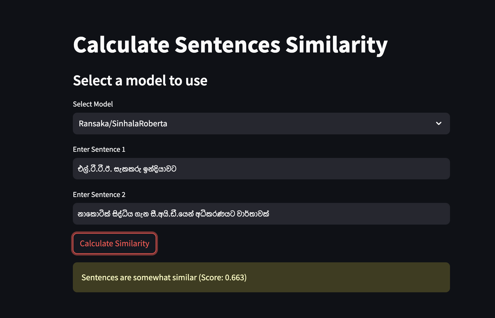
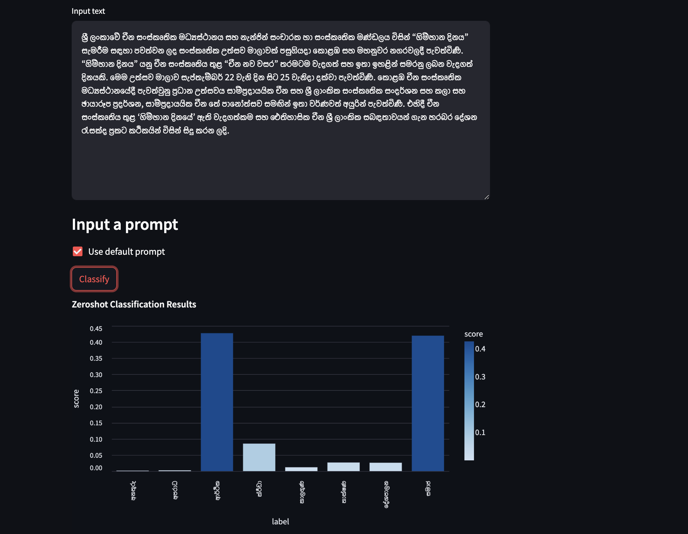

# Projects

=== Daily Llama

Retrieval augmented generation framework based on news contents.

This project presents a retrieval-augmented generation framework tailored for news content. By employing the FAISS index for efficient similarity search, relevant documents are retrieved. Leveraging the LLAMA-2 model, these retrieved documents serve as a foundation for generating comprehensive and contextually accurate answers.

[!ref target="blank" text="Github"](https://github.com/Ransaka/daily-llama)

==- First Ever Sinhala Sentence Transformer Model

Indepedent research project to create the first ever Sinhala Sentence Transformer Model. I was able to create a model that can be used to encode Sinhala sentences into vectors. This model can be used for various NLP tasks such as sentence similarity, sentence classification, etc. Further, I was able to create a BERT model that can be used for Sinhala masked language modeling. For more information, please refer to the HuggingFace space below.

[!ref target="blank" text="Sinhala Embeddings"](https://huggingface.co/spaces/Ransaka/sinhala-embedding-space)

==- Sinhala Zero-Shot Text Classification

Another research project I did to create a zero-shot text classification model for Sinhala. As part of this project, I have trained 3 BERT models with different architectures. Working demo is available in the HuggingFace space below.

[!ref target="blank" text="Sinhala Zero Shot Classification"](https://huggingface.co/spaces/Ransaka/Sinhala-ZeroShot-Classification)
===